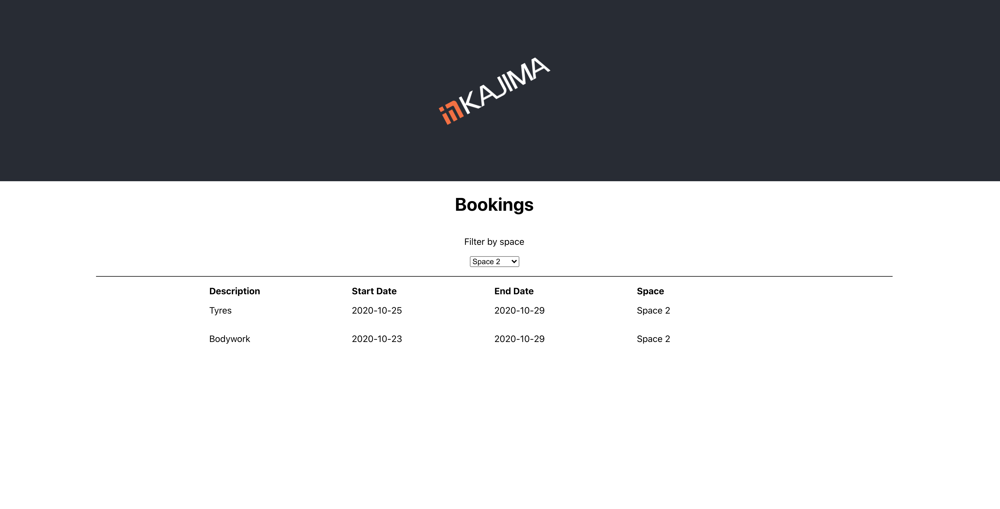

# README

Ruby version: 2.6.5

Rails version: 6.0.3

Database: Postgres

## Setup:
#### Database
`RAILS_ENV=development db:create`

`RAILS_ENV=development db:migrate`

`RAILS_ENV=development db:seed`

#### Run Servers
##### Backend
`cd api`

`bundle install`

`rails s`

##### Frontend
`cd ui`

`npm start`

#### Tests
##### Frontend
`npm test`

##### Backend
`cd api`

`RAILS_ENV=test db:create`

`RAILS_ENV=test db:migrate`

`bundle exec rspec`